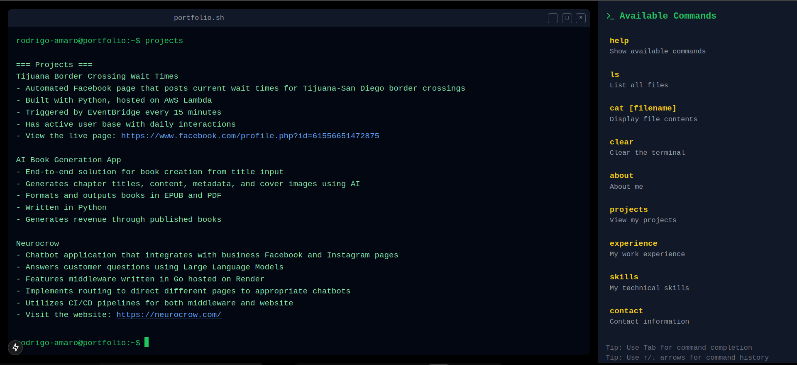

# Terminal Portfolio Website



## Overview

This is an interactive terminal-style portfolio website built with Next.js and React. It simulates a command-line interface where visitors can explore my background, projects, skills, and contact information using familiar Unix-like commands.

## Features

- **Interactive Terminal Interface**: Type commands or click on them in the sidebar
- **Command History**: Navigate through previously entered commands using arrow keys
- **Tab Completion**: Press Tab to autocomplete commands
- **Mobile Responsive**: Optimized for both desktop and mobile viewing
- **Clickable Commands**: Non-technical visitors can simply click commands in the sidebar
- **Syntax Highlighting**: Different colors for commands, output, and links

## Available Commands

- `help` - Show available commands
- `ls` - List all files
- `cat [filename]` - Display file contents
- `clear` - Clear the terminal
- `about` - Display information about me
- `projects` - Show my projects
- `experience` - Show my work experience
- `skills` - List my technical skills
- `contact` - Display my contact information

## Technologies Used

- **Next.js 15** - React framework with App Router
- **React 19** - UI library
- **TypeScript** - Type safety
- **Tailwind CSS** - Styling
- **Lucide React** - Icons
- **Vercel** - Deployment

## Getting Started

### Prerequisites

- Node.js 18.17 or later
- npm, yarn, or pnpm

### Installation

1. Clone the repository:
   ```bash
   git clone https://github.com/yourusername/terminal-portfolio.git
   cd terminal-portfolio
   ```

2. Install dependencies:
   ```bash
   npm install
   # or
   yarn install
   # or
   pnpm install
   ```

3. Run the development server:
   ```bash
   npm run dev
   # or
   yarn dev
   # or
   pnpm dev
   ```

4. Open [http://localhost:3000](http://localhost:3000) in your browser to see the result.

## Project Structure

```
terminal-portfolio/
├── app/                  # Next.js App Router
│   ├── globals.css       # Global styles
│   ├── layout.tsx        # Root layout
│   └── page.tsx          # Home page
├── components/           # React components
│   ├── command-list.tsx  # Sidebar command list
│   ├── terminal.tsx      # Terminal component
│   └── terminal-output.tsx # Terminal output formatting
├── hooks/                # Custom React hooks
│   └── use-terminal.tsx  # Terminal logic and state
├── lib/                  # Utility functions
│   └── utils.ts          # Helper utilities
├── public/               # Static assets
└── ...config files
```

## Customization

To customize the content:

1. Edit the files object in `hooks/use-terminal.tsx` to update the content displayed for each command
2. Modify the commands array in `components/command-list.tsx` to add or remove available commands
3. Update the styling in `app/globals.css` to change the appearance

## Deployment

The easiest way to deploy this app is using [Vercel](https://vercel.com):

```bash
npm install -g vercel
vercel
```

## License

This project is licensed under the MIT License - see the LICENSE file for details.

## Acknowledgments

- Inspired by terminal-based interfaces and retro computing
- Thanks to the Next.js team for the excellent framework
- Special thanks to all open-source contributors

---

Created by [Rodrigo Amaro](https://github.com/Rodriamarog)
